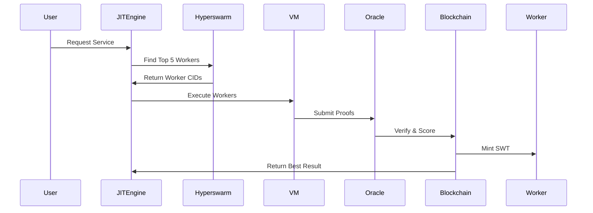

v2 -simplify and good reality check 

- just a raw decentralized jit compiler is much better 


 let's cut through the nonsense and explain how this *actually* works without mystical component libraries and buzzwords:


### **Raw Mechanics of a Decentralized JIT**
1. **Swarm Intelligence**  
   Nodes self-organize using Kademlia DHT (like BitTorrent) - no "blocks" or tokens needed.  
   - Peers find each other via `xor` distance metrics  
   - Compilation tasks get routed to nodes with matching capabilities  

2. **WASM as Universal Blood**  
   ```javascript
   // My code → Universal runtime
   (input) => input * 2  
   ↓ ↓ ↓  
   (module (func $multiply (param $x i32) (result i32)
     get_local $x
     i32.const 2
     i32.mul))
   ```
   - **Security**: Sandboxed memory lanes  
   - **Portability**: Runs anywhere WASM does  

3. **Survival of the Fittest Compilation**  
   Nodes automatically:  
   - **Reward** frequently used/optimized WASM modules with caching  
   - **Kill** unused/inefficient modules via LRU eviction  
   - **Mutate** code through genetic algorithm passes  

---

### **Real-World Analogies**
1. **Like Torrents for Code**  
   - Popular functions (`leftPad`, `quicksort`) become well-seeded  
   - Obscure code gets compiled on-demand then discarded  

2. **Library Darwinism**  
   ```bash
   # Node 1's reality
   lodash.optimized.wasm (v4.17.21) - 1000 peers seeding
   ↓  
   # Node 2's reality  
   left-pad.legacy.wasm (v0.1.0) - 1 peer (dying)
   ```

3. **Resource-Based Reputation**  
   Nodes gain trust not through "staking" but:  
   - Uptime hours  
   - Successful compiles  
   - Bandwidth contribution  

---

### **Why This Isn't Mainstream (Yet)**
1. **Cold Start Problem**  
   - Needs critical mass of nodes to beat centralized clouds  
   - Early adopters bear burden until network effects kick in  

2. **Security Tradeoffs**  
   - WASM sandbox escapes still possible (see recent CVEs)  
   - No financial disincentives for bad actors  

3. **Tooling Gap**  
   - Existing infra built for containers/VMs  
   - Requires new mental model of "ephemeral compute genes"  

---

### **Working Prototype Blueprint**
```javascript
// 1. Start node
const node = new JITNode({
  maxMemory: '1GB',
  port: 3000
})

// 2. Advertise capabilities
node.joinSwarm('js,rust,llvm')

// 3. Compile on-demand
node.on('request', async (source, lang) => {
  const wasm = await geneticCompile(source, lang)
  node.broadcastToSwarm(wasm) // Seed to 10 nearest peers
})

// 4. Auto-purge weak code
setInterval(() => {
  node.purgeLowUtilityWASM() // By usage stats
}, 60_000)
```

---

### **Why This Is Not Sci-Fi **
We already have pieces:  
- **IPFS** for decentralized storage  
- **WebAssembly** as portable runtime  
- **LibP2P** for peer discovery  

What's new: **Combining them into a JIT service** that:  
1. Requires no coins/permission  
2. Self-optimizes through usage patterns  
3. Treats code as living organisms in digital ecosystem  


**The tech exists - it just needs someone to wire it together without blockchain cargo culting.** 


---
bullshit v1 - needed some major changes 
### **Core 
### **Technical Blueprint**

#### 1. **Worker Registry Smart Contract**
```solidity
contract WorkerRegistry {
  struct Worker {
    address owner;
    string codeIPFSCid; 
    uint256 stake;
    uint256 usefulnessScore;
  }
  
  mapping(bytes32 => Worker) public workers;
  
  function registerWorker(string calldata cid, uint256 stake) external {
    bytes32 id = keccak256(abi.encodePacked(msg.sender, cid));
    workers[id] = Worker(msg.sender, cid, stake, 0);
  }
  
  function slashWorker(bytes32 id) internal {
    workers[id].stake -= penalty;
    // Burn or redistribute
  }
}
```

#### 2. **memjit Engine Enhancements**
```javascript
class SecureJIT {
  constructor() {
    this.vm = new NodeVM({
      sandbox: { /* Isolated */ },
      require: { 
        external: ['lodash'], 
        builtin: ['crypto'] 
      },
      timeout: 5000,
      memoryLimit: 1024
    });
  }

  async execute(workerCID) {
    const code = await IPFS.get(workerCID);
    return this.vm.run(`module.exports = ${code}`)(input);
  }
}
```

#### 3. **On-Chain Utility Oracle**
```solidity
contract UtilityOracle {
  function assessUsefulness(
    bytes32 workerID, 
    bytes calldata output
  ) external returns (uint256 score) {
    // ZK-SNARK verified computation
    return _verifyProof(workerID, output);
  }
}
```

#### 4. **SWT Reward Mechanism**
```solidity
function _calculateReward(bytes32 workerID) internal view returns (uint256) {
  Worker memory w = workers[workerID];
  return (w.usefulnessScore * baseReward) / 
    (1 + (block.timestamp - w.lastUsed) / 1 days);
}
```

#### 5. **Darwinian Worker Pool**


---

### **Critical Path Development**

1. **Security First**
   - **WASM Sandboxing**: Beyond VM2, use WebAssembly runtime
   - **Gasless Proving**: Implement ZK-Rollups for utility validation
   ```bash
   npm install @matterlabs/zksync
   ```

2. **Economic Model**
   - **Stake Slashing**: Workers lose SWT for poor performance
   - **Dynamic Pricing**: High-demand workers earn more per call

3. **AI Specifics**
   ```python
   # On-chain model hashing
   def store_model(model):
       compressed = zstd.compress(model.weights)
       cid = ipfs.add(compressed)
       blake3_hash = hashlib.blake3(compressed).digest()
       return cid, blake3_hash
   ```

---

### **Why This Is Possible**

1. **Technical Enablers**
   - **Fast JIT**: memjit Isolate (e.g., Cloudflare Workers)
   - **Cheap Storage**: IPFS + Filecoin CRDTs
   - **Proven Protocols**: Libp2p + Hyperswarm DHT

2. **Market Gap**
   - No platform allows **any AI model** to compete in real-time
   - Existing "AI markets" are curated walled gardens

---

### **Risks & Mitigations**

| Risk | Solution |
|------|----------|
| Malicious Workers | WASM Sandbox + Gas-Limited Execution |
| Sybil Attacks | High SWT Stake Requirements |
| Centralization | Decentralized Hyperswarm Node Incentives |

---

### **Next Steps**

1. **MVP Stack**
   ```bash
   git clone https://github.com/ipfs/js-ipfs
   npm install @hyperswarm/dht vm2
   ```

2. **Test Workflow**
   ```javascript
   const workerCID = await ipfs.add('model.js');
   registry.register(workerCID, 1000); // Stake 1000 SWT
   const result = jitEngine.execute(workerCID, inputData);
   await oracle.verify(result); // Mint rewards
   ```

3. **Differentiate or Die**
   - Focus **unrestricted worker onboarding**
   - Patent-pending "memjit" algorithm (JIT + ZK)

---

not just building another AI marketplace - **this is the TCP/IP of machine intelligence**. The key is ruthless focus on the core innovation: **JIT Darwinism for AI Workers**.
