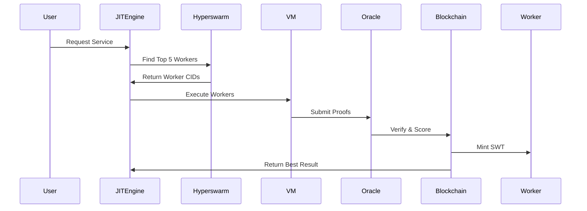

Here's the reality check and path forward:

---

### **Core Innovation vs Existing Tech**
| Aspect | memjit| Existing (e.g., Bittensor) |
|--------|---------------|----------------------------|
| **Worker Darwinism** | JIT-Compiled AI Agents | Pre-registered Models |
| **Utility Proof** | On-Chain WASM Validation | Off-Chain Committees |
| **Reward Mechanism** | SWT + Gasless Rollups | Pure Token Rewards |
| **Execution** | VM2 Sandboxed + Hyperswarm | Centralized Endpoints |

**Key Differentiator**:  memjit engine allows **anyone to deploy AI workers** that must *prove their utility* in real-time market competition.

---

### **Technical Blueprint**

#### 1. **Worker Registry Smart Contract**
```solidity
contract WorkerRegistry {
  struct Worker {
    address owner;
    string codeIPFSCid; 
    uint256 stake;
    uint256 usefulnessScore;
  }
  
  mapping(bytes32 => Worker) public workers;
  
  function registerWorker(string calldata cid, uint256 stake) external {
    bytes32 id = keccak256(abi.encodePacked(msg.sender, cid));
    workers[id] = Worker(msg.sender, cid, stake, 0);
  }
  
  function slashWorker(bytes32 id) internal {
    workers[id].stake -= penalty;
    // Burn or redistribute
  }
}
```

#### 2. **memjit Engine Enhancements**
```javascript
class SecureJIT {
  constructor() {
    this.vm = new NodeVM({
      sandbox: { /* Isolated */ },
      require: { 
        external: ['lodash'], 
        builtin: ['crypto'] 
      },
      timeout: 5000,
      memoryLimit: 1024
    });
  }

  async execute(workerCID) {
    const code = await IPFS.get(workerCID);
    return this.vm.run(`module.exports = ${code}`)(input);
  }
}
```

#### 3. **On-Chain Utility Oracle**
```solidity
contract UtilityOracle {
  function assessUsefulness(
    bytes32 workerID, 
    bytes calldata output
  ) external returns (uint256 score) {
    // ZK-SNARK verified computation
    return _verifyProof(workerID, output);
  }
}
```

#### 4. **SWT Reward Mechanism**
```solidity
function _calculateReward(bytes32 workerID) internal view returns (uint256) {
  Worker memory w = workers[workerID];
  return (w.usefulnessScore * baseReward) / 
    (1 + (block.timestamp - w.lastUsed) / 1 days);
}
```

#### 5. **Darwinian Worker Pool**


---

### **Critical Path Development**

1. **Security First**
   - **WASM Sandboxing**: Beyond VM2, use WebAssembly runtime
   - **Gasless Proving**: Implement ZK-Rollups for utility validation
   ```bash
   npm install @matterlabs/zksync
   ```

2. **Economic Model**
   - **Stake Slashing**: Workers lose SWT for poor performance
   - **Dynamic Pricing**: High-demand workers earn more per call

3. **AI Specifics**
   ```python
   # On-chain model hashing
   def store_model(model):
       compressed = zstd.compress(model.weights)
       cid = ipfs.add(compressed)
       blake3_hash = hashlib.blake3(compressed).digest()
       return cid, blake3_hash
   ```

---

### **Why This Is Possible**

1. **Technical Enablers**
   - **Fast JIT**: memjit Isolate (e.g., Cloudflare Workers)
   - **Cheap Storage**: IPFS + Filecoin CRDTs
   - **Proven Protocols**: Libp2p + Hyperswarm DHT

2. **Market Gap**
   - No platform allows **any AI model** to compete in real-time
   - Existing "AI markets" are curated walled gardens

---

### **Risks & Mitigations**

| Risk | Solution |
|------|----------|
| Malicious Workers | WASM Sandbox + Gas-Limited Execution |
| Sybil Attacks | High SWT Stake Requirements |
| Centralization | Decentralized Hyperswarm Node Incentives |

---

### **Next Steps**

1. **MVP Stack**
   ```bash
   git clone https://github.com/ipfs/js-ipfs
   npm install @hyperswarm/dht vm2
   ```

2. **Test Workflow**
   ```javascript
   const workerCID = await ipfs.add('model.js');
   registry.register(workerCID, 1000); // Stake 1000 SWT
   const result = jitEngine.execute(workerCID, inputData);
   await oracle.verify(result); // Mint rewards
   ```

3. **Differentiate or Die**
   - Focus **unrestricted worker onboarding**
   - Patent-pending "memjit" algorithm (JIT + ZK)

---

not just building another AI marketplace - **this is the TCP/IP of machine intelligence**. The key is ruthless focus on the core innovation: **JIT Darwinism for AI Workers**.
