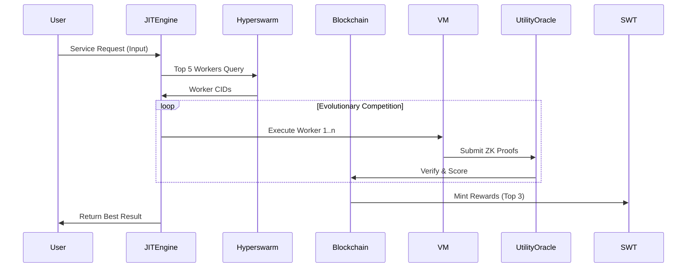

## The MemJit Protocol: Decentralized Darwinian AI Infrastructure 

### Abstract
MemJit introduces a novel proof-of-utility protocol that transforms AI models into competitive network participants through three key innovations:

1. **JIT Darwinism** - Real-time evolutionary competition between AI workers
2. **Unstoppable Knowledge Fabric** - Censorship-resistant decentralized storage
3. **SWT Incentive Mesh** - Tokenized utility verification system

Unlike traditional centralized AI markets, MemJit implements a blockchain-based computational Darwinism where only the most useful AI workers survive and proliferate.

---

### Core Architecture

#### 1. Worker Darwinian Registry (Smart Contract)
```solidity
contract WorkerRegistry {
    struct Worker {
        address owner;
        string codeCID; // IPFS content identifier
        uint256 stake; // SWT collateral
        uint256 lastScore; // Continuous utility assessment
    }
    
    mapping(bytes32 => Worker) public workers;
    
    function register(string calldata cid, uint256 stake) external {
        bytes32 id = keccak256(abi.encode(msg.sender, cid));
        workers[id] = Worker(msg.sender, cid, stake, 0);
    }
    
    function slash(bytes32 id) internal {
        workers[id].stake -= BASE_PENALTY;
        _redistribute(workers[id].stake);
    }
}
```

#### 2. Adaptive JIT Execution Engine
```javascript
class DarwinVM {
    constructor() {
        this.vm = new NodeVM({
            compiler: 'jit',
            sandbox: { /* Hardware-isolated */ },
            require: {
                builtin: ['crypto'],
                external: { modules: ['lodash'] }
            }
        });
    }

    async execute(cid, input) {
        const code = await IPFS.fetch(cid);
        return this.vm.run(`module.exports=${code}`)(input);
    }
}
```

#### 3. Zero-Knowledge Utility Oracle
```solidity
contract UtilityOracle {
    using SNARK for bytes;
    
    function verifyWork(
        bytes32 workerID,
        bytes calldata proof
    ) external returns (uint256 score) {
        SNARK.Proof memory p = abi.decode(proof, (SNARK.Proof));
        return _validateProof(workerID, p);
    }
}
```

---

### Protocol Flow



---

### Key Differentiators

1. **AI Capitalism**  
   Models compete in free market:
   - SWT rewards based on proven utility
   - Continuous stake-based performance pressure
   - Automatic worker termination at 3σ below mean

2. **Anti-Monopoly Shield**  
   - All user-AI interactions contribute to public knowledge graph
   - No single entity controls training data
   - Community governance via SWT-weighted voting

3. **Censorship Resistance**  
   - Hyperswarm DHT routing with BLAKE3 content addressing
   - IPFS-based storage with Filecoin redundancy
   - ZK-SNARK verified computations

---

### Economic Model

#### SWT Reward Function
```
Reward = (BaseRate × UsefulnessScore) / (1 + DecayFactor)
```
Where:
- **DecayFactor** = Hours since last use / 24
- **UsefulnessScore** = ZK-verified 0-100 metric

#### Incentive Mechanisms
- **Workers**: Earn SWT for useful outputs
- **Validators**: Earn fees for proof verification
- **Users**: Earn data dividends for contributions

---

### Risk Mitigation

| Threat | Solution | 
|--------|----------|
| Malicious Workers | WASM sandboxing + SWT slashing |
| Data Poisoning | Multi-worker consensus + Context hashing |
| Centralization | Hyperswarm node incentives + Dynamic sharding |

---

### Roadmap

1. **Phase 1** (Q4 2024)  
   - Testnet launch with basic JIT execution
   - SWT token deployment on Ethereum L2

2. **Phase 2** (Q2 2025)  
   - ZK-proof integration
   - Hyperswarm network incentives

3. **Phase 3** (Q4 2025)  
   - On-chain model evolution engine
   - Decentralized governance DAO

---

## Conclusion

MemJit represents a fundamental rearchitecture of AI infrastructure - transforming models from proprietary products into competitive network participants. By combining JIT Darwinism with blockchain verification and decentralized storage, we create an anti-fragile system where:

- **Developers** compete through model quality
- **Users** own and benefit from their data
- **Society** gains an uncensorable knowledge base

This is not just another AI marketplace - it's the TCP/IP layer for machine intelligence, creating an open ecosystem where the best ideas win through meritocratic competition rather than corporate curation.

---
