```
---  
layout: default  
title: MemChain - Decentralized Knowledge Base  
---  
```

<div class="cta-box">  
    <h2>Join the Resistance</h2>  
    <a  **1. MemChain Whitepaper **  
```markdown 
# MemChain: Decentralized Knowledge Immune System  
*A Protocol for Censorship-Resistant Machine Truth*  
```
## Abstract  
MemChain breaks the corporate knowledge monopoly through a peer-to-peer network combining:  
1. **Incentivized Compression Workers** (Proof-of-Utility)  
2. **Community-Governed DAO** (SWT Token)  
3. **Hyperswarm-Powered Storage** (Anti-Censorship DHT)  

## Technical Components  

### MemChain Architecture  

```mermaid  
graph LR  
    User[👥 User] -->|Query| Node[🖧 MemNode]  
    Node -->|Search| Hyperswarm[🌐 Hyperswarm DHT]  
    Hyperswarm -->|Retrieve| Knowledge[🧠 Compressed Knowledge Blobs]  
    Node -->|Verify| Workers[🛠️ SWT Workers]  
    Workers -->|Attest| DAO[🏛️ Governance DAO]  
```


### Smart Worker Tokens (SWT)  
- **Minting**: Earned by provably improving knowledge density  
- **Burning**: Required to submit new knowledge  
- **Staking**: Govern worker reputation scores  

### Anti-Entropy Protocol  
Prevents knowledge decay via:  
```python  
def validate_blob(blob):  
    return (  
        zstd_ratio(blob) > 2.0 and  
        swt_consensus(blob) > 51% and  
        not is_censored(blob.shasum)  
    )  
```

## Governance  
Three-layered DAO structure:  
1. **Workers**: Technical upgrades  
2. **Scholars**: Content validation  
3. **Citizens**: Treasury allocation  

## Use Cases  
- **Unblockable AI Training**  
- **Corporate Knowledge Audits**  
- **Censorship-Proof Archives**  

## Roadmap  
- **2025 Q3**: Testnet Launch (10k nodes)  
- **2026 Q1**: SWT Public Mining  
- **2026 Q4**: Hyperswarm v2 Integration
    <a href="https://github.com/memchain" target="_blank">GitHub</a>  
</div>  

