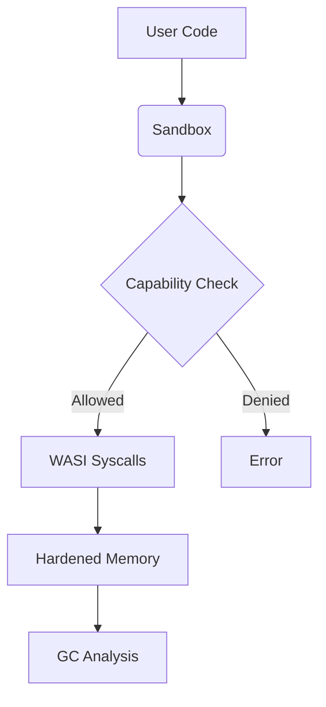

### Installation 
npm install vm2 @noble/hashes # Core dependencies



### "defense in depth" 
## Maintains Decentralized JIT Vision
```js
// Safe execution with limited capabilities
const runtime = new JITRuntime(['math']);
const result = await runtime.execute(wasmModule, 42);

// Full-featured execution (caution!)
const fullRuntime = new JITRuntime(['math', 'io', 'net']);
```