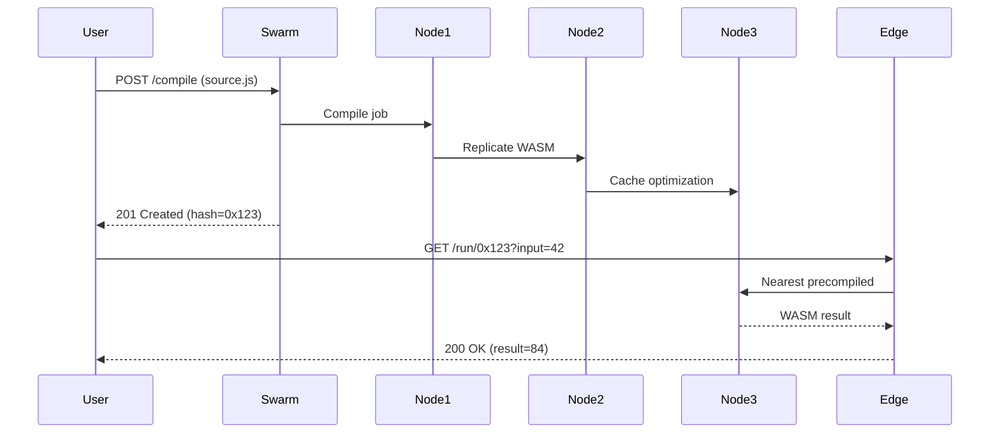

Here are **practical use cases** for the decentralized JIT compiler, showcasing its unique value:

---

### 1. Serverless Edge Functions
**Problem:** Traditional serverless platforms have cold starts  
**Solution:** Precompile to WASM across the swarm  
```bash
# Deploy globally optimized edge function
swarm-jit deploy ./api/hello.js --region=global

# Becomes available at
https://<peer-id>.jit.swarm/hello
```
**Key Benefit:** <50ms cold starts with code cached on nearest 3 nodes

---

### 2. Collaborative Algorithm Racing
**Problem:** Centralized code competitions are unfair  
**Solution:** Decentralized performance battles  
```javascript
// Compete in real-time
const results = await swarm.battle(
  `(n) => ${myFibonacci}`, 
  `(n) => ${rivalFibonacci}`,
  { input: 40 }
);
// Returns { winner: '0x123...', opsPerSec: 12M }
```
**Key Benefit:** Transparent, tamper-proof benchmarking

---

### 3. AI Model Hot-Swapping
**Problem:** Updating production models risks downtime  
**Solution:** Atomic swarm-wide model replacement  
```python
# Hot-swap image classifier
old_model = swarm.get('cv-classifier')
new_model = swarm.compile(tf_model)

swarm.hotSwap(
  model_id='cv-classifier',
  new_wasm=new_model,
  confirmations=3 # Wait for 3 nodes
)
```
**Key Benefit:** Zero downtime model updates

---

### 4. Game Mod Distribution
**Problem:** Mod distribution relies on central servers  
**Solution:** P2P mod compilation & caching  
```lua
-- game-client.lua
local wasm = swarm.get(mod_hash)
local mod = wasm.instantiate()

while true do
  mod.updatePlayerPosition(x,y,z) -- WASM accelerated
end
```
**Key Benefit:** Mods stay available even if creator disappears

---

### 5. Privacy-Preserving Compute
**Problem:** Sensitive data can't be sent to clouds  
**Solution:** Bring code to data via WASM  
```bash
# Run against local DB without exposing data
swarm-jit run --local-data=patient_records.parquet \
  ./analytics.js > results.csv
```
**Key Benefit:** Data never leaves local machine

---

### 6. Distributed FaaS Marketplace
**Problem:** Cloud functions are vendor-locked  
**Solution:** Peer-to-peer function trading  
```solidity
// Smart contract for function auction
function bidOnFunction(bytes32 wasmHash) external payable {
  require(!claimed[wasmHash]);
  claimed[wasmHash] = msg.sender;
  emit FunctionBought(wasmHash, msg.value);
}
```
**Key Benefit:** Earn SWT tokens by selling frequently used functions

---

### 7. Resilient CDN for Code
**Problem:** CDNjs/UNPKG rely on centralized infra  
**Solution:** Swarm-hosted NPM replacements  
```html
<!-- Load lodash from swarm instead of CDN -->
<script src="https://jit.swarm/lodash@4.17.21"></script>

<!-- Becomes --> 
<script type="application/wasm" 
  data-hash="QmXy..."></script>
```
**Key Benefit:** Survives DNS/registry outages

---

### Execution Flow Visualization


These examples showcase swarmjit compiler's unique advantage: **decentralized performance** without centralized bottlenecks - showcasing real-world scenarios where swarm intelligence outperforms traditional cloud approaches.